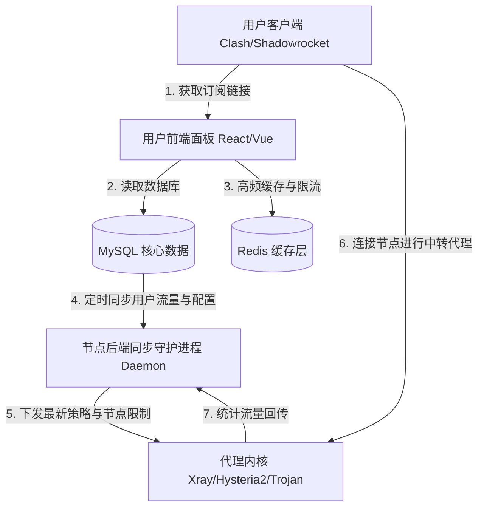

# Aurora-Panel: 多用户中转与订阅管理系统 (Airport Management System)

Aurora-Panel 是一款专为高速网络中转服务商（“机场”运营者）设计的**多用户订阅管理与流量计费系统**。系统采用前后端分离架构，前端使用 React/Vue 提供极致流畅的用户交互，后端基于 PHP (Laravel) / Python (FastAPI) 提供强大的高并发 API 支撑，并深度整合 Xray, Hysteria 2, Shadowsocks 等主流代理协议内核。

---

## 🏗️ 系统架构图 (System Architecture)



---

## 🌟 核心功能特性

### 1. 多协议内核与传输加速支持
* **核心协议**：支持 **VLESS Reality (TCP/XTLS)**、**VMess (WS/gRPC)**、**Trojan (gRPC)**，并深度集成最新高吞吐率低延迟的 **Hysteria 2** 与 **TUIC** 协议。
* **分流与中转**：支持公网隧道中转（端口转发）、经典单机中转和多级节点路由，满足不同网络环境下的加速需求。

### 2. 自动化订阅转换系统 (Built-in Subconverter)
* 系统内置高性能订阅转换引擎，将统一的节点配置格式动态生成为不同客户端适配的专属配置，一键下发到 **Clash Verge, Shadowrocket, Quantumult X, Surge, Loon, v2rayN** 等客户端。

### 3. 多渠道支付与计费周期管理
* **财务面板**：支持设置按月、按年、一次性或按流量计费的阶梯式套餐，支持优惠券、邀请返利和新用户首单优惠。
* **支付集成**：支持微信/支付宝官方接口、易支付（Epays）三方聚合支付、以及加密货币支付网关，支持全自动付款激活回调。

### 4. 节点守护进程 (Daemon) 与流量统计
* 后端分布式节点监控守护进程定时以秒级频率（5-10s）与主站 MySQL 数据库/Redis 缓存通信，同步用户流量额度、速率限制、IP 连接数，当用户流量超出或到期时，毫秒级实现节点阻断。

---

## 📂 推荐目录结构 (Repository Structure)

```text
├── aurora-panel-web/          # 前端管理与用户面板 (React/Vite)
├── aurora-panel-api/          # 后端计费与订阅 API 核心 (Laravel/PHP)
├── aurora-node-daemon/        # 后端节点同步守护进程 (Go/Python)
├── docker-compose.yml         # 主站一键部署配置
└── README.md                  # 本说明文档
```

---

## 💻 代码高亮：节点流量统计与授权校验守护进程

以下为 Go/Python 编写的节点守护进程中，定时同步主站配置与上报用户流量的核心逻辑抽象：

```python
import time
import requests

PANEL_URL = "http://your-panel.com/api/v1/node"
NODE_KEY = "node_secure_auth_key_12345"
NODE_ID = 5

class NodeDaemon:
    def __init__(self):
        self.headers = {"X-Node-Key": NODE_KEY, "Content-Type": "application/json"}
        
    def sync_users(self):
        """从主站拉取最新的有效用户 UUID 列表"""
        url = f"{PANEL_URL}/users?node_id={NODE_ID}"
        try:
            res = requests.get(url, headers=self.headers, timeout=5)
            if res.status_code == 200:
                user_list = res.json().get("users", [])
                print(f"Successfully synced {len(user_list)} active users.")
                return user_list
        except Exception as e:
            print(f"Sync users failed: {e}")
        return []

    def report_traffic(self, traffic_data):
        """上报节点上捕获的用户流量消耗数据"""
        # traffic_data format: { "user_uuid": bytes_consumed }
        url = f"{PANEL_URL}/traffic"
        payload = {
            "node_id": NODE_ID,
            "data": traffic_data
        }
        try:
            res = requests.post(url, headers=self.headers, json=payload, timeout=5)
            if res.status_code == 200:
                print("Traffic data reported successfully.")
                return True
        except Exception as e:
            print(f"Report traffic failed: {e}")
        return False

# daemon = NodeDaemon()
# while True:
#     active_users = daemon.sync_users()
#     # ... update local xray config with active_users ...
#     # ... collect traffic usage from xray api ...
#     # daemon.report_traffic(collected_data)
#     time.sleep(60)
```
