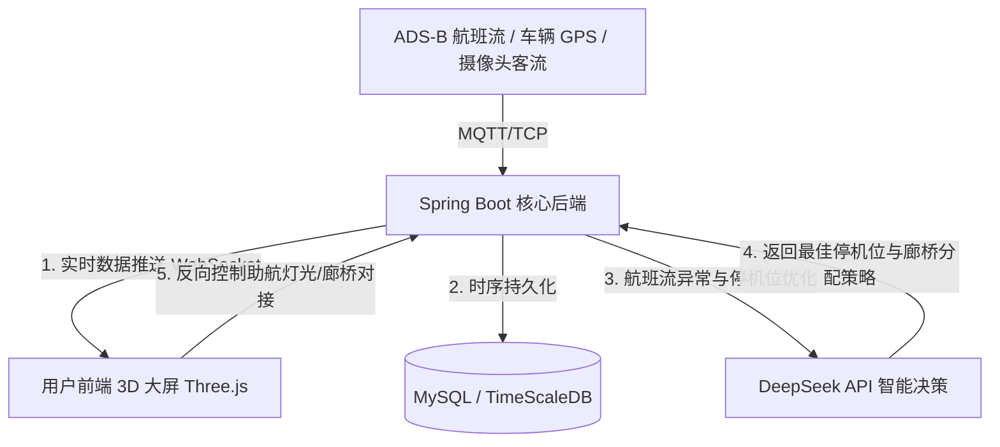

# AeroTwin: 3D 机场数字孪生与运行管控系统 (Spring Boot + Three.js + DeepSeek)

AeroTwin 是一款基于 **Spring Boot**、**Three.js (WebGL)** 和 **DeepSeek API** 架构构建的**三维物理机场数字孪生与智能化运行可视化大屏系统**。系统通过对机场航站楼、跑道、机坪车辆及航班状态进行 1:1 三维数字化仿真，并结合 WebSocket 实时遥测数据与 DeepSeek 智能辅助决策，实现机场运行调度与客流态势感知的一屏管控。

---

## 🏗️ 机场数字孪生系统架构图



---

## 🌟 核心功能系统

### 1. 飞行区机坪运行数字孪生 (Airfield Operations Twin)
* **航班实时动态仿真**：接收 WebSocket 航班状态，在 3D 机坪跑道上动态模拟飞机的落地、转弯滑行及起飞过程，实时显示高度与航向角。
* **机坪特种车辆（GSE）GPS 追踪**：实时展示行李车、摆渡车、加油车在三维场景中的物理位置与移动轨迹，支持车辆防碰撞预警。

### 2. 航站楼旅客流量热力图 (Terminal Passenger Flow Heatmap)
* **基于 Shader 的空间热力渲染**：利用 Three.js 自定义着色器（Custom Shader），将安检柜台与值机口的实时客流排队数据转化为航站楼 3D 空间内的客流拥挤度渐变热力图，预警拥堵。

### 3. 行李分拣输送仿真孪生 (Baggage Handling System Twin)
* **BHS 分拣流水线仿真**：三维动画仿真行李箱在输送带上的流动路径，当发生行李滑槽堵塞时，3D 界面自动闪烁红色警报，并支持点击调取视频监控。

### 4. 跑道助航灯光控制与天气粒子系统 (Runway Lighting & Weather)
* **跑道灯光模拟**：1:1 仿真跑道入口灯、PAPI 坡度灯状态，支持从 3D 界面一键下发指令反向控制物理设备。
* **环境天气仿真**：基于 WebGL Particle System 粒子系统，动态模拟雨、雪、大雾等气象环境对跑道视程的可视化影响。

### 5. 基于 DeepSeek API 的智能机位指派与调度 (DeepSeek AI Dispatcher)
* 当航班由于天气发生大面积延误时，传统人工指派停机位极易错乱。系统通过 **DeepSeek-V3 API** 综合评估航站楼内客流饱和度、当前空闲停机位、廊桥状态和航班预计到达时间，自动输出**最优的停机位与廊桥指派策略**，并生成调度日志。

---

## 📂 目录结构 (Repository Structure)

```text
├── src/main/java/com/aurora/twin/      # Spring Boot 后端核心业务代码
│   ├── controller/                     # WebSocket 接口与 DeepSeek 控制器
│   ├── service/                        # 停机位智能分配业务逻辑
│   └── config/                         # WebSocket 终端与安全配置
├── src/main/resources/
│   ├── static/                         # 前端 Web 资源
│   │   ├── js/airport_twin.js          # Three.js 核心 3D 渲染与 WebGL 逻辑
│   │   └── index.html                  # 3D 可视化大屏主页面
│   └── application.yml                 # 数据库、WebSocket 及 DeepSeek 密钥配置
└── pom.xml                             # Maven 依赖配置文件
```

---

## 💻 技术栈 (Tech Stack)

* **三维前端**：Three.js, WebGL, GLSL Shaders, WebSocket Client, HTML5 Canvas
* **业务后端**：Spring Boot (Java 17), Spring WebSocket, MyBatis-Plus
* **人工智能**：DeepSeek-V3 API (基于 JSON Mode 格式化决策提取)
* **数据存储**：MySQL 8.0, Redis (热数据与实时定位缓存)
